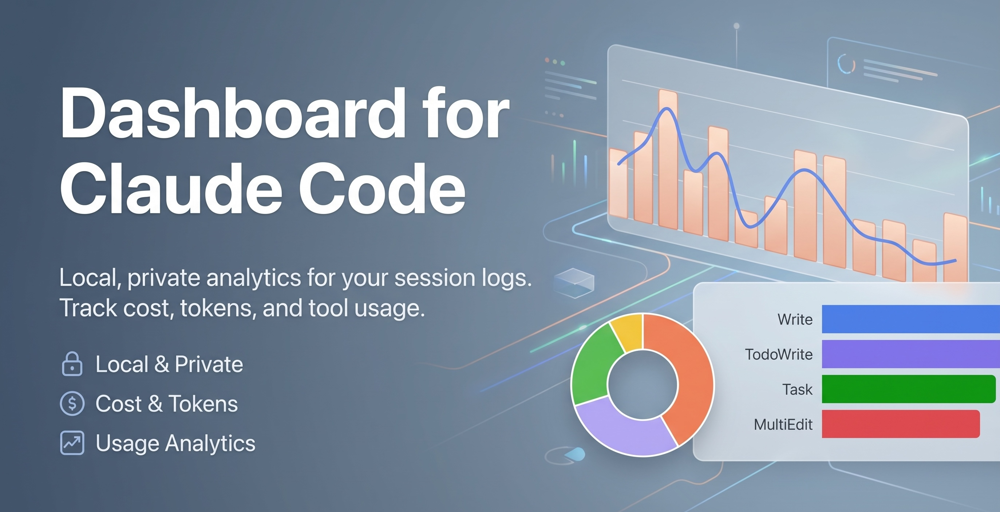
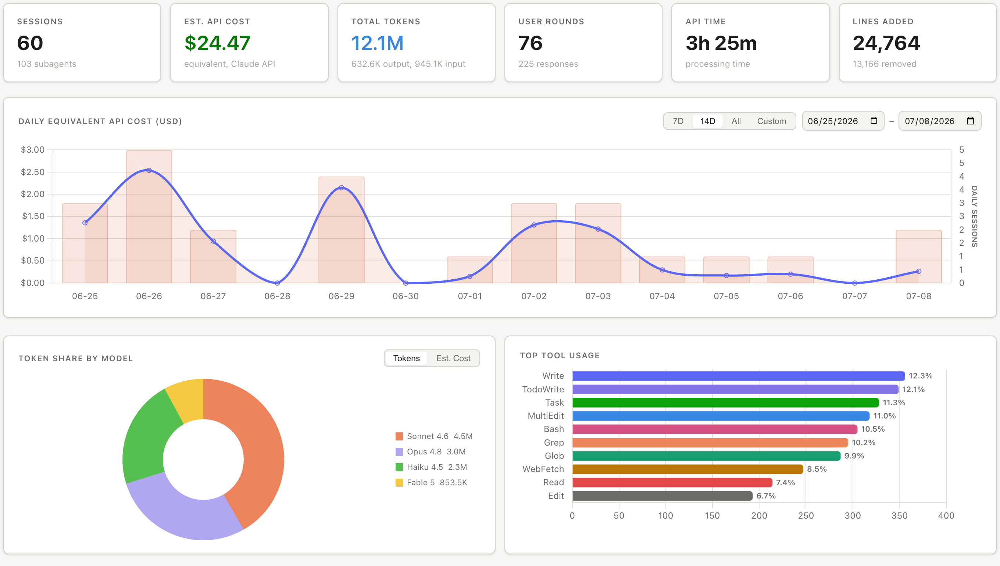
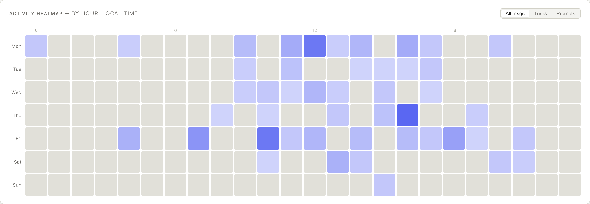
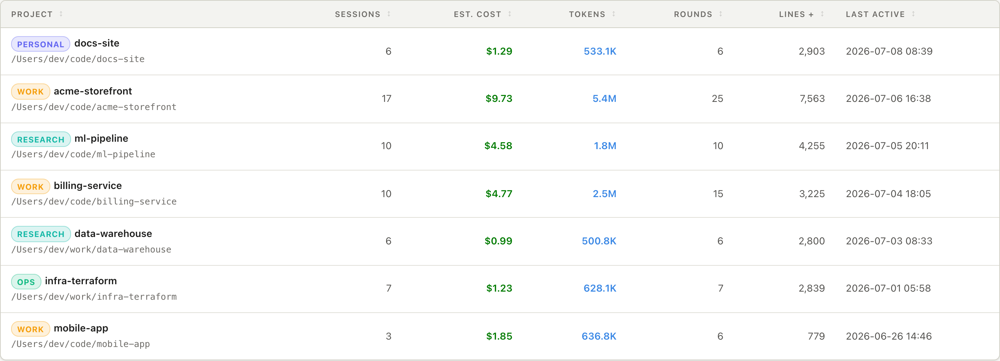
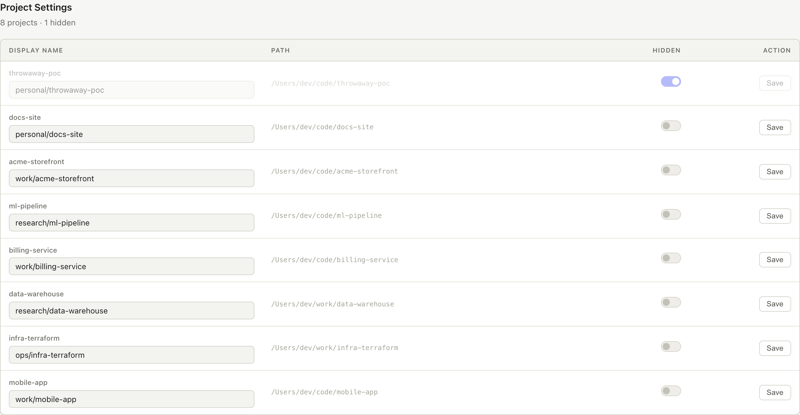
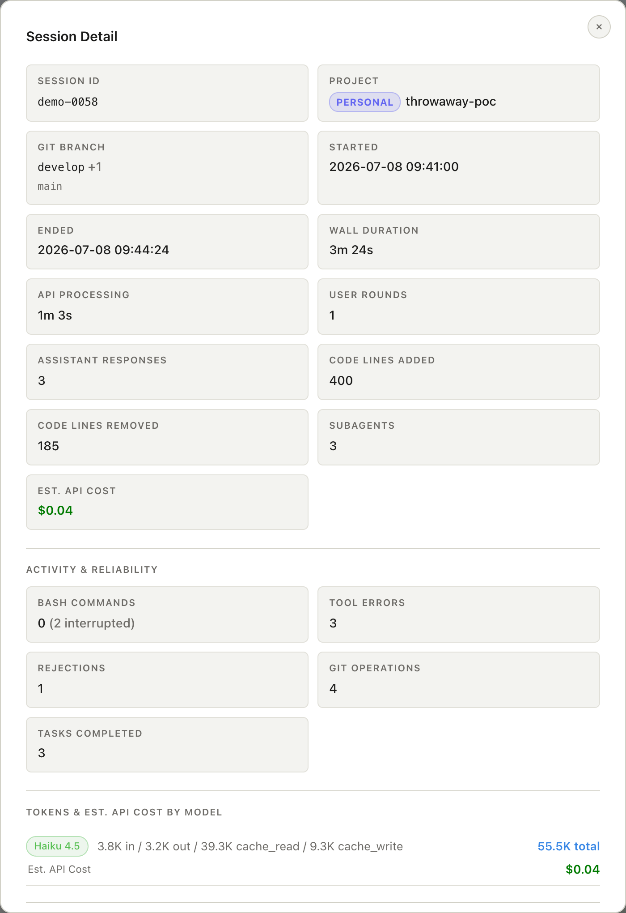
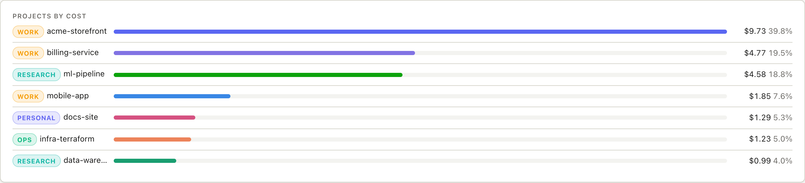
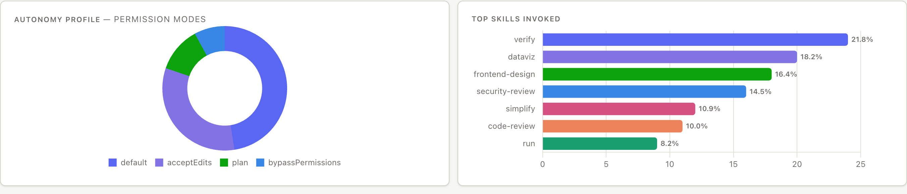

# Dashboard for Claude Code



A local, **read-only** dashboard for your [Claude Code](https://docs.claude.com/en/docs/claude-code) session logs. Track API costs, token usage by model, tool invocations, and activity patterns — per project and per session.

Everything runs on your machine. Your session logs are **never modified** and **never leave your computer** unless you explicitly choose to deploy a static export.

[](https://github.com/heyuehuan/dashboard-for-claude-code/actions/workflows/ci.yml)
[](LICENSE)


> **Unofficial project.** This is a community tool. It is **not affiliated with, endorsed by, or sponsored by Anthropic**. "Claude" and "Claude Code" are trademarks of Anthropic, PBC; they are used here only to describe what this tool is compatible with. See [Trademarks](#trademarks).

## Run it with Claude Code

Already using Claude Code? Skip the manual steps — paste this prompt and let it set everything up:

> Set up and run this dashboard on my machine — follow the steps in CLAUDE_README.md.

Claude reads [CLAUDE_README.md](CLAUDE_README.md) and handles `uv sync`, starts the server, and opens **http://localhost:8042** for you.

**Rough cost:** about **$0.11 per run** and **~163K tokens** (measured on a sample run with Sonnet 4.6: 10 input / 1.1K output / 150.1K cache read / 12.3K cache write), typically finishing in under a minute. This is only an estimate — actual token usage and cost vary from run to run depending on the model, your environment, and how the steps are worked through.

Prefer to do it by hand? See [Setup](#setup) and [Run](#run) below.

## Screenshots

All screenshots show synthetic placeholder data generated by `scripts/demo_data.py`.



The **activity heatmap** shows when you actually work (weekday × hour, local time):













> **Using Claude Code to set this up?** See [CLAUDE_README.md](CLAUDE_README.md) for step-by-step instructions Claude can follow to install, run, and optionally generate AI session summaries.

## Features

- **Overview** — headline KPIs (sessions, rounds, lines changed, equivalent cost) plus:
  - Daily equivalent-cost chart with 7D / 14D / all / custom ranges
  - Token share by model (tokens or estimated cost)
  - Top tool usage and top skills invoked
  - Projects ranked by cost
  - Activity heatmap (weekday × hour, local time) toggleable by messages / turns / prompts
  - Autonomy profile from permission-mode usage
- **Projects** — per-project totals with rename, color-coded tagging (a `tag/name` display name), and hide controls
- **Sessions** — searchable list with per-session detail: duration, API time, tokens, tools, code churn, git branch, reliability signals, and optional summaries
- **Cost estimation** — *equivalent* API pricing per model (see [Pricing](#a-note-on-pricing)), editable in one file
- **Fast, incremental scans** — sessions are cached in a local SQLite DB; only files whose size/mtime changed are re-parsed
- **Optional token auth** and **optional static export** for private remote hosting

## How it works

Claude Code writes a JSONL transcript per session under `~/.claude/projects/`. This tool:

1. Scans those transcripts (read-only) and extracts per-session metrics.
2. Caches the results in `data/usage.db` (SQLite) so subsequent startups are instant.
3. Serves a small single-page dashboard from a local FastAPI server.

No transcript is ever written to; the raw content of your prompts stays on disk and is never sent anywhere.

## Requirements

- Python 3.11+
- [uv](https://docs.astral.sh/uv/) (recommended) — or any PEP 517 installer
- An existing `~/.claude/projects/` directory (created by Claude Code)

## Setup

```bash
uv sync
```

## Run

```bash
uv run python -m claude_dashboard
```

Then open **http://localhost:8042**.

If you've installed the package (`uv pip install -e .` or `pipx install .`), the
**`dashboard-for-claude-code`** command works the same way:

```bash
dashboard-for-claude-code
```

Run `dashboard-for-claude-code --help` for the available flags (`--host`, `--port`, `--version`).

On first startup, all sessions are parsed in the background, so the UI appears immediately and fills in as the scan completes. Later startups are fast (incremental). Click **Refresh** in the header any time to re-scan.

### Access from other devices on your LAN

By default the server binds to `127.0.0.1:8042`, so it is reachable **only from your own machine**. To expose it to other devices on your local network, set `DASHBOARD_HOST=0.0.0.0`; it will then be reachable at `http://<your-lan-ip>:8042`. Only do this on networks you trust — the dashboard has no auth unless you set `DASHBOARD_AUTH_TOKEN` (see below).

## Configuration

All configuration is via environment variables; the bind interface and port can
also be set with the `--host` / `--port` flags, which take precedence:

| Variable | Default | Description |
| --- | --- | --- |
| `DASHBOARD_HOST` | `127.0.0.1` | Interface to bind. Localhost-only by default; use `0.0.0.0` to expose on your LAN. |
| `DASHBOARD_PORT` | `8042` | Port to serve on. |
| `DASHBOARD_AUTH_TOKEN` | _(unset)_ | If set, requires a bearer token on API calls (see [scripts/SECURITY.md](scripts/SECURITY.md)). |
| `DASHBOARD_REDACT_HOME` | `1` (in export) | Replaces your home-directory prefix with `~` in exported data. |
| `DASHBOARD_DB` | `data/usage.db` | Path to the SQLite cache. Point it elsewhere to keep a separate database (e.g. for a demo). When running from an installed package (pipx/uvx) rather than a source checkout, the default is `~/.local/share/dashboard-for-claude-code/usage.db` (respects `XDG_DATA_HOME`). |
| `DASHBOARD_NO_SCAN` | _(unset)_ | If set, skips the automatic scan on startup. Used by tests and the demo-data flow so a run never reads `~/.claude`. |
| `DASHBOARD_SUMMARY_FILE` | `session_summary.json` next to the DB | Where `scripts/set_summaries.py` writes optional session summaries. |

To expose on your LAN:

```bash
DASHBOARD_HOST=0.0.0.0 uv run python -m claude_dashboard
```

> **Note:** always launch via `python -m claude_dashboard` (or the
> `dashboard-for-claude-code` command) and configure the bind with
> `DASHBOARD_HOST` or `--host`. Running uvicorn directly (`uvicorn
> claude_dashboard.app:app --host 0.0.0.0`) leaves the app thinking it is
> localhost-only, and its Host-header protection will reject LAN requests
> with 403.

### Sessions deleted by Claude Code

Claude Code prunes old transcripts after its `cleanupPeriodDays`. The dashboard
deliberately **keeps** those sessions in its cache so your history survives. If
you want the cache to mirror the disk instead, trigger a pruning refresh:

```bash
curl -X POST 'http://localhost:8042/api/refresh?prune=true'
```

## Privacy & security

- **Read-only.** The dashboard never modifies your Claude Code logs.
- **Local by default.** Data stays on your machine; nothing is uploaded.
- **Your prompts are not exported.** The optional static export deliberately strips raw prompt text and can redact home-directory paths.

If you choose to host the dashboard remotely, read [scripts/SECURITY.md](scripts/SECURITY.md) for access-control guidance (Cloudflare Access, origin IP allowlisting, token auth). See also [SECURITY.md](SECURITY.md) for how to report a vulnerability.

## Optional: static export & remote deployment

You can export the dashboard as a static site (no server, no live access to your logs) and host it privately:

```bash
python scripts/export.py            # writes remote_public/
```

The [`scripts/`](scripts/) directory contains helpers for exporting, deploying, and auto-refreshing. See [scripts/README.md](scripts/README.md).

## A note on pricing

Costs are calculated at equivalent pay-as-you-go API rates — useful for gauging usage scale even if you're on a subscription. Rates are defined (as of May 2026) in [`src/claude_dashboard/pricing.py`](src/claude_dashboard/pricing.py); update that file if rates change or a model is missing.

## Development

`uv sync` installs runtime dependencies only, so running the dashboard stays lean.
Contributors need the full toolchain (tests, linter, security scanner), which lives
in opt-in dependency groups:

```bash
uv sync --all-groups
```

Then run the test suite (and, optionally, the same security scan CI runs):

```bash
uv run --group dev pytest -v
uv run --group security bandit -c pyproject.toml -r src/claude_dashboard scripts
```

### Project layout

```
src/claude_dashboard/
  __main__.py     # entrypoint (uvicorn)
  app.py          # FastAPI routes + optional auth
  scanner.py      # walks ~/.claude/projects, orchestrates parsing
  parser.py       # extracts metrics from a session JSONL
  pricing.py      # per-model equivalent API rates
  store.py        # SQLite cache + queries
  static/         # single-page UI (vanilla JS + Chart.js)
scripts/          # export / deploy / refresh helpers
tests/            # pytest suite
```

## Contributing

Contributions are welcome — see [CONTRIBUTING.md](CONTRIBUTING.md).

## Third-party

- [Chart.js](https://www.chartjs.org/) (MIT) is vendored at `src/claude_dashboard/static/chart.umd.min.js`.

## License

[MIT](LICENSE) © The dashboard-for-claude-code contributors.

## Trademarks

"Claude" and "Claude Code" are trademarks of Anthropic, PBC. This project is an
independent, community-maintained tool and is not affiliated with, endorsed by,
or sponsored by Anthropic. References to Claude Code describe interoperability
only (nominative use); no affiliation or endorsement is implied.
